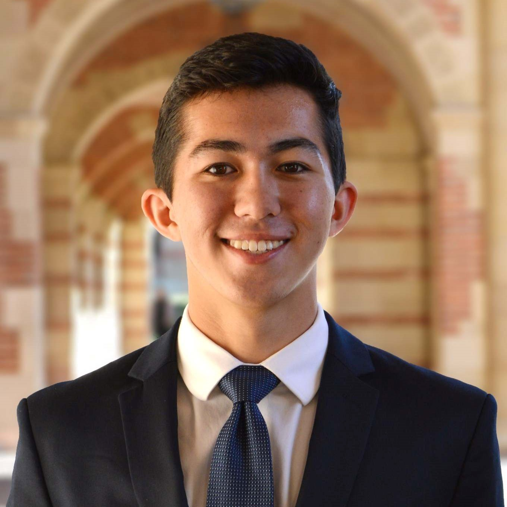
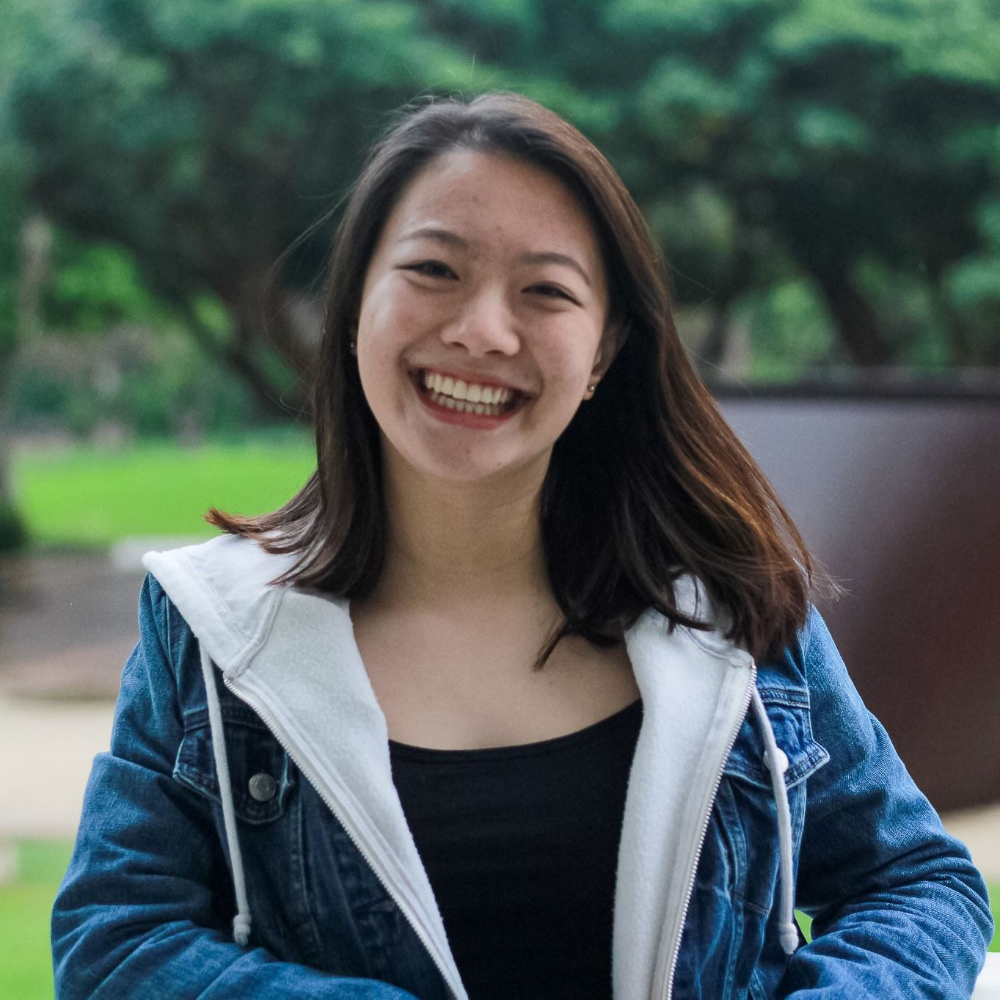
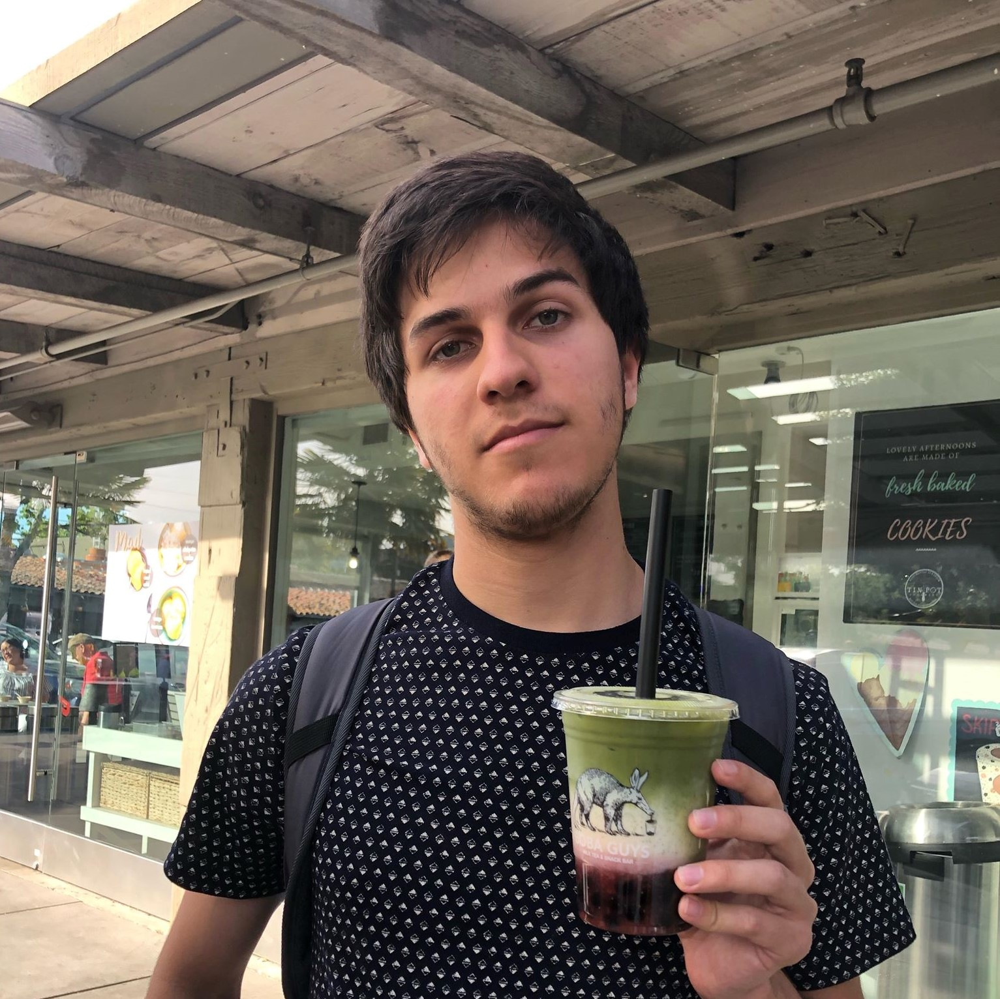
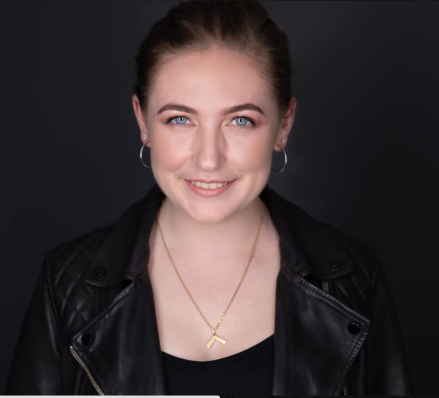
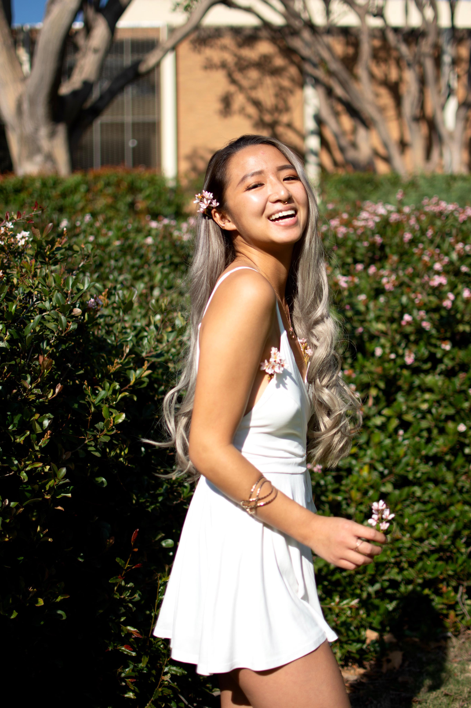
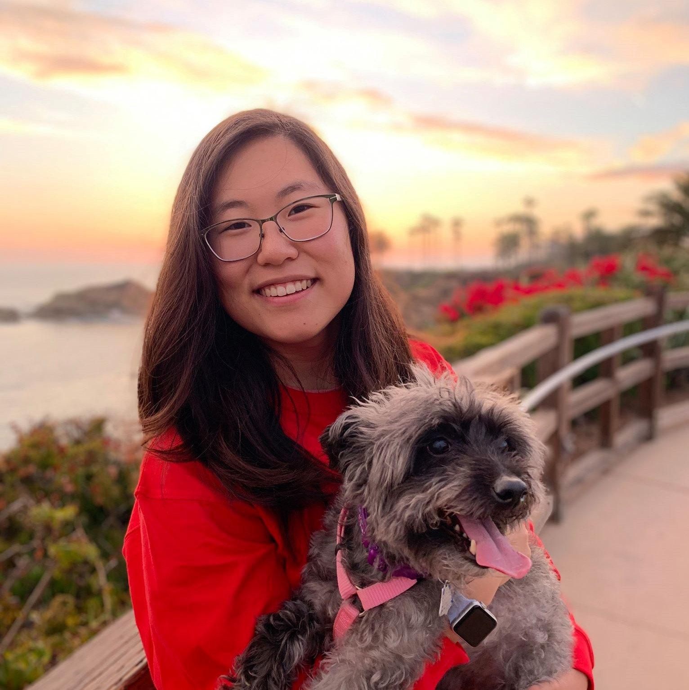
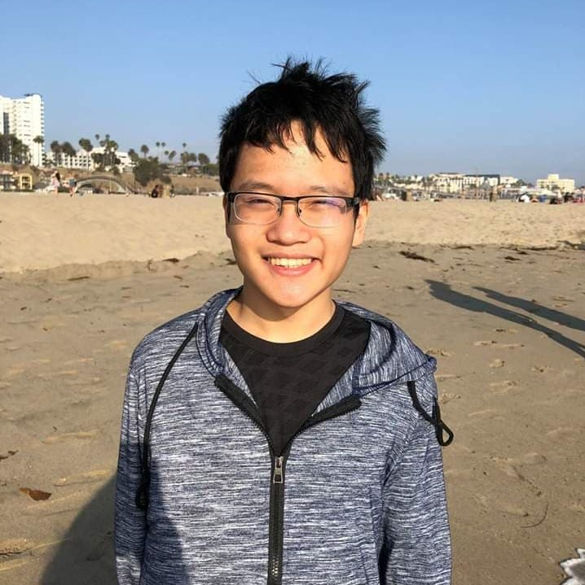
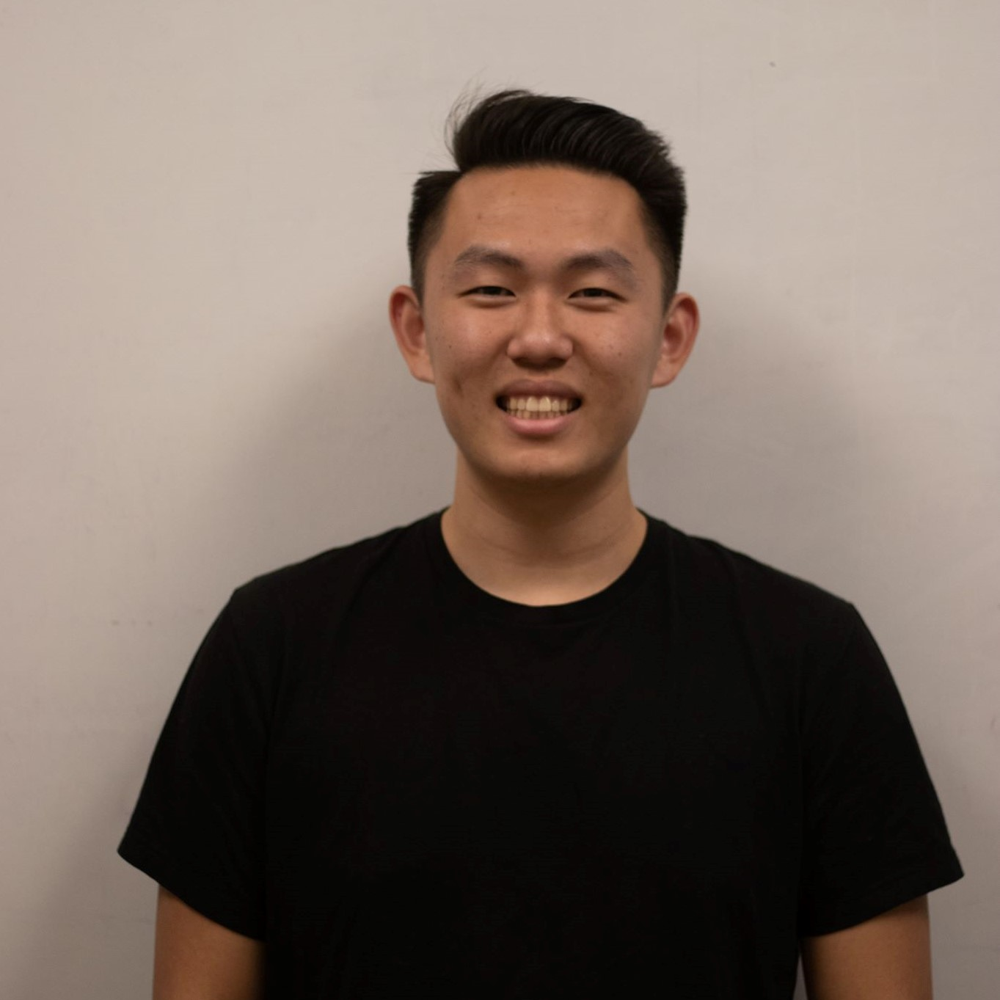
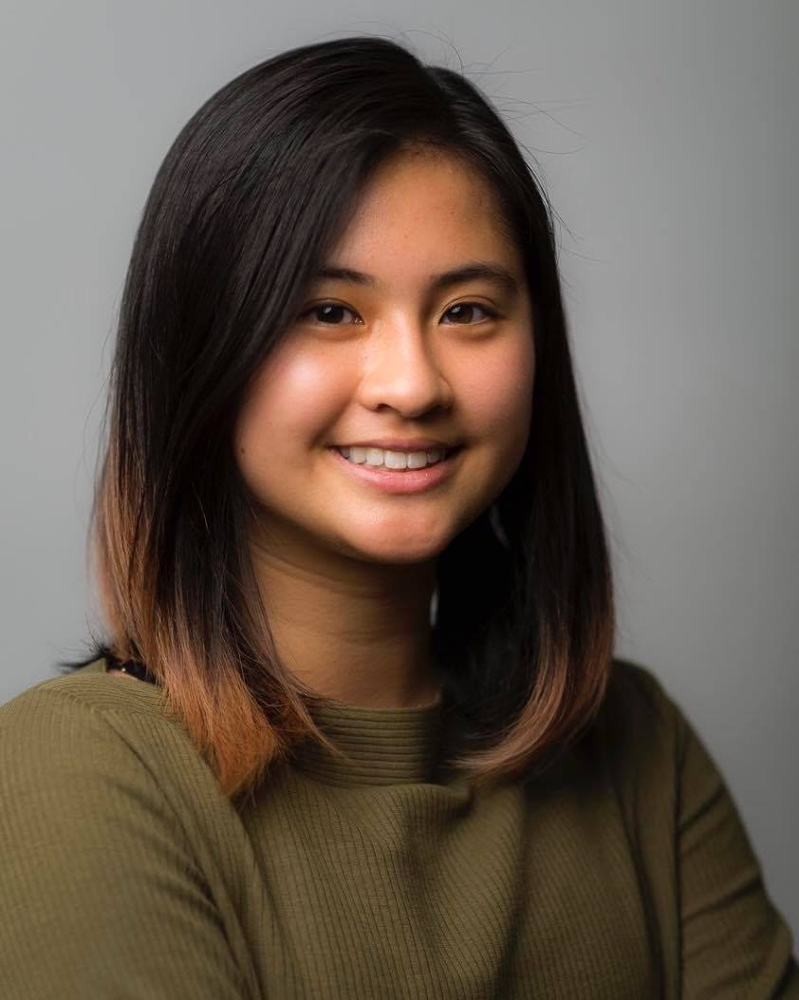

# fLOW
Code for fLOW, a personal water usage tracker. fLOW is a project through Creative Labs at UCLA led by Allison Chen and Carla Cornillon.

### Motivation
We would like to work with the intersection between technology and engineering and sustainability. Each and every one of us wastes water while we're washing our hands, brushing our teeth, etc. The goal of this project is to develop a device to measure water usage and display a user's trends over time. By bringing attention and awareness to the problem, individuals can actively make lifestyle changes to play their part in conserving water.

## Meet the Team
### Design Team
**Nick Hom** | Second Year Economics Major 

**Sammi Owyang** | Second Year Cognitive Science Major 

### Hardware Team
**Juan Banchs** | Second Year Mechanical Engineering Major 

**Carla Cornillon** | Second Year Mechanical Engineering Major 

**Nhung Nguyen** | Third Year  

**Rosa Son** | Second Year Mechanical Engineering Major 

### Software Team
**Allison Chen** | Second Year Computer Science Major 

**Ray Huang** | First Year Computer Science Major 

**Andrew Li** | Second Year Electrical Engineering Major 

**Raeka Lin** | First Year Computer Science Major 

